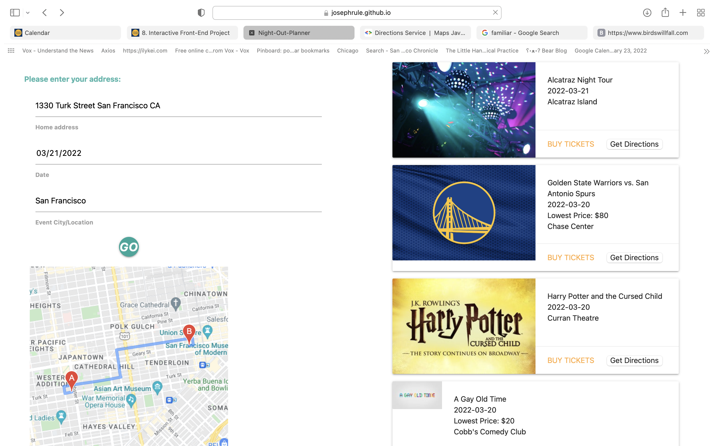

# Night-Out-Planner

Description - Web application to help plan going to events using ticketmaster and google maps api.

User Story - I would like to find a fun event to go to this weekend, but I am not familiar with all the venues in the city to know if an event is worth traveling to. I want to  see events in my city and quickly get directions to the venue to see if the event is worth traveling to.

## Technologies:
CSS framework - https://materializecss.com/icons.html
JQuery
APIs -
* https://developer.ticketmaster.com/products-and-docs/apis/discovery-api/v2/#search-events-v2

* https://developers.google.com/maps/documentation/javascript/

screenshot
